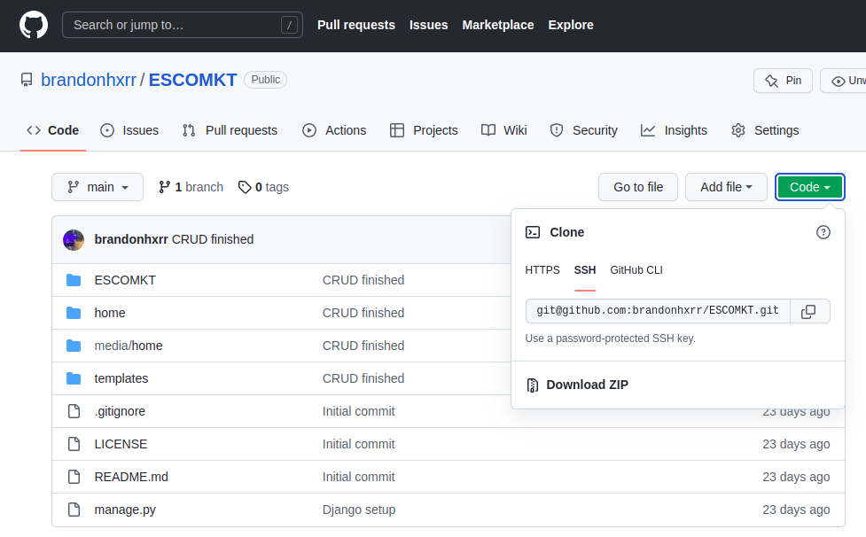
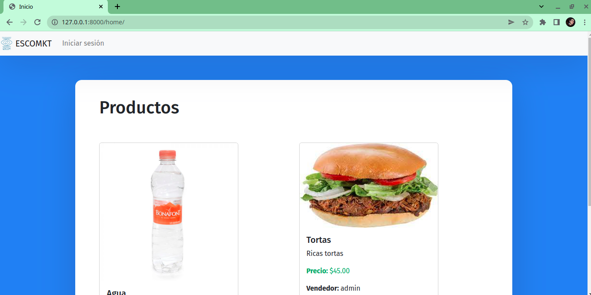

# ESCOMKT
A website to buy and sell products from the ESCOMUNITY

## Installation:

Create a folder named 'ESCOMKT'

```bash
mkdir ESCOMKT
cd ESCOMKT
```

Clone the repository from https://github.com/brandonhxrr/ESCOMKT



```bash
git clone git@github.com:brandonhxrr/ESCOMKT.git
```

Create and activate the virtual environment

```bash
python -m virtualenv -p python3 venv
#On Linux
source venv/bin/activate

#On Windows
venv\Scripts\activate
```

Enter the application folder:

```bash

cd ESCOMKT
```

Install the python packages:

```bash
pip install -r requirements.txt
```

Run the server:

python [manage.py](http://manage.py) runserver

The project should be displayed at the following address:

[](http://127.0.0.1:8000/home/)


